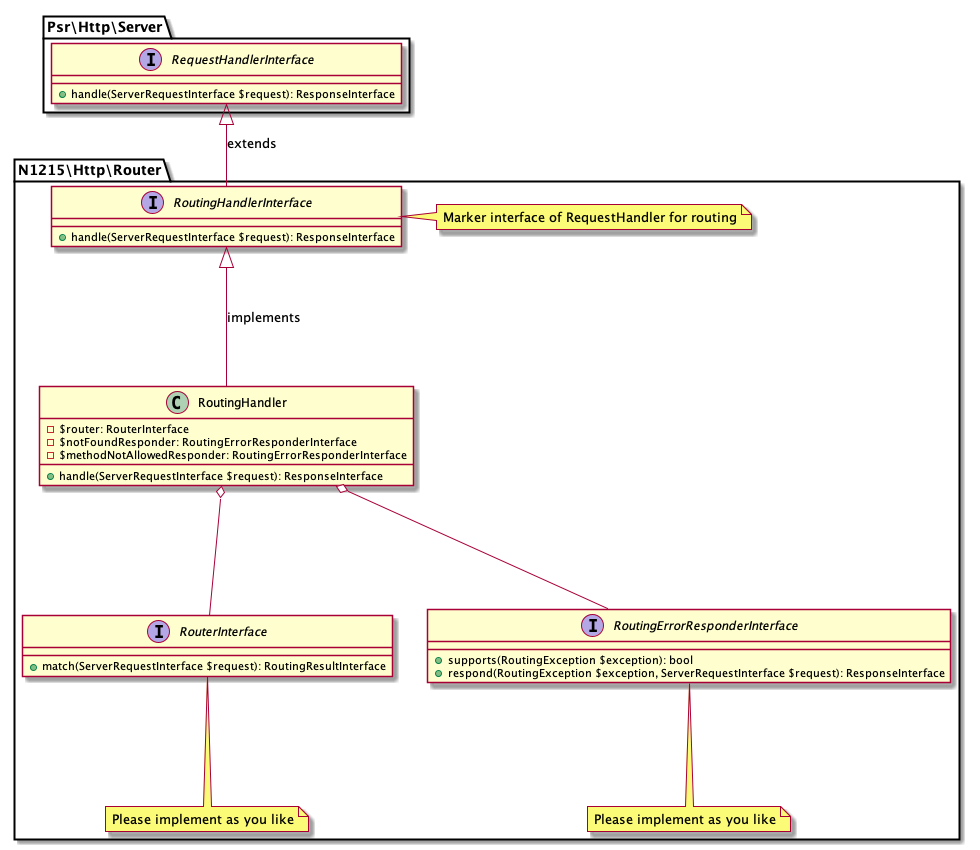

# http-router

[](https://packagist.org/packages/n1215/http-router)
[](https://packagist.org/packages/n1215/http-router)
[](https://scrutinizer-ci.com/g/n1215/http-router/build-status/master)
[](https://scrutinizer-ci.com/g/n1215/http-router/?branch=master)
[](https://scrutinizer-ci.com/g/n1215/http-router/?branch=master)

A PSR-7 / PSR-15 compatible router interface and a PSR-15 server request handler implementation for routing.

This package helps you to create your own http router.

## Usage

```php
<?php

// 1. Implement RouterInterface. You can use RoutingError and RoutingResult concrete classes.
class YourRouter implements N1215\Http\Router\RouterInterface
{
    public function match(ServerRequestInterface $request) : RoutingResultInterface
    {
        // implement
    }
}

// 2. Implement RoutingErrorResponderInterface.
class YourRoutingErrorResponder implements N1215\Http\Router\RoutingErrorResponderInterface
{
    public function respond(ServerRequestInterface $request, RoutingErrorInterface $error): ResponseInterface
    {
        // implement
    }
}

// 3. Configure to inject them into RoutingHandler.
$routingHandler = new N1215\Http\Router\RoutingHandler(
    new YourRouter(),
    new YourRoutingErrorResponder()
);

// 4. Use RoutingHandler as an implementation of PSR-15 server request handler.
/** @var \Psr\Http\Message\ServerRequestInterface $request */
/** @var \Psr\Http\Message\ResponseInterface $response */
$response = $routingHandler->handle($request);

```

## Implementation examples
* Router -> [n1215/hakudo](https://github.com/n1215/hakudo/blob/v0.3.0/src/Router.php)
* RoutingErrorHandler -> [n1215/tsukuyomi-demo](https://github.com/n1215/tsukuyomi-demo/blob/v0.2.0/app/Http/Routing/RoutingErrorResponder.php)

## Class diagrams

### RouterInterface


### RoutingErrorInterface and RoutingErrorResponderInterface


### RoutingHandler

